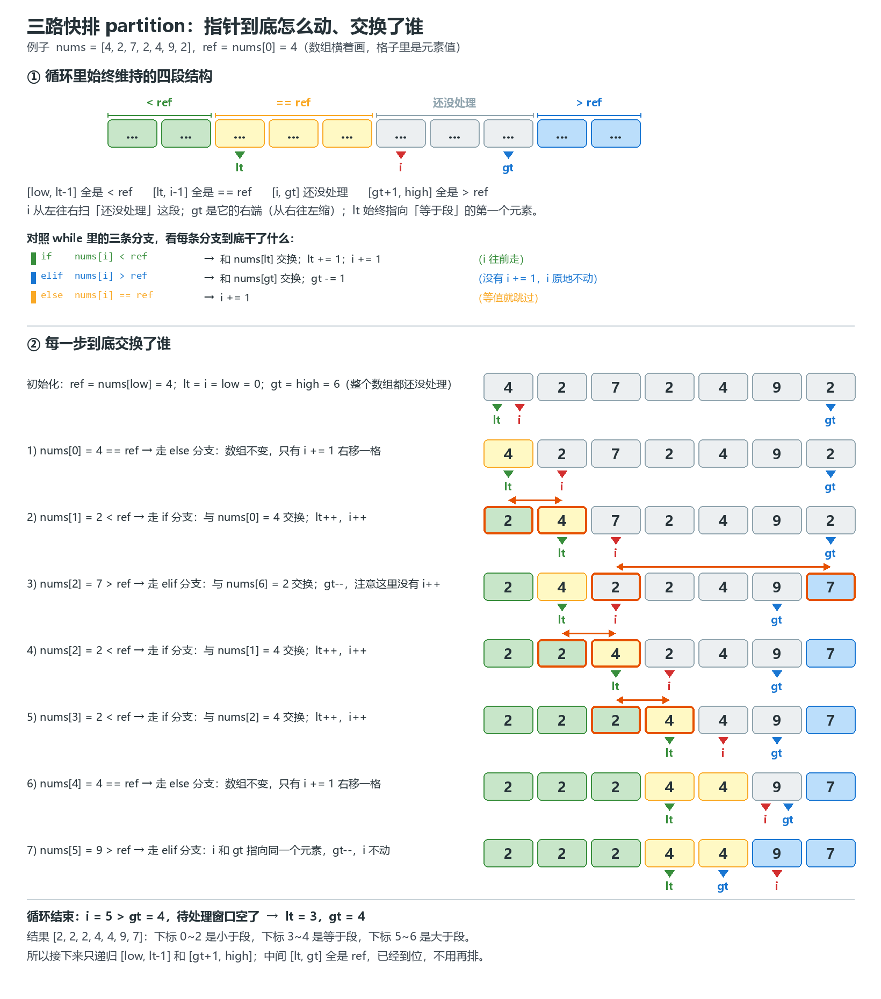

# LeetCode 刷题记录

> 记录题号与代码

记录我的 LeetCode 刷题过程。每道题的代码放在 `solutions/` 目录下，题号与文件一一对应，并按题目记录在下面的索引表里。

- **仓库地址**：<https://github.com/chameleonn4/leetcode->
- **已刷题目**：8 题（简单 4、中等 4，持续更新中）
- **使用语言**：Python3

## 题目索引

| # | 题目 | 难度 | 语言 | 思路 | 代码 | 日期 |
| --- | --- | --- | --- | --- | --- | --- |
| 1 | [两数之和](https://leetcode.cn/problems/two-sum/) | 简单 | Python3 | 哈希表 | [0001-two-sum.py](solutions/0001-two-sum.py) | 2026-10-07 |
| 2 | [两数相加](https://leetcode.cn/problems/add-two-numbers/) | 中等 | Python3 | 哑结点 + 逐位相加 | [0002-add-two-numbers.py](solutions/0002-add-two-numbers.py) | 2026-10-08 |
| 16 | [最接近的三数之和](https://leetcode.cn/problems/3sum-closest/) | 中等 | Python3 | 排序 + 双指针 | [0016-3sum-closest.py](solutions/0016-3sum-closest.py) | 2026-10-08 |
| 26 | [删除有序数组中的重复项](https://leetcode.cn/problems/remove-duplicates-from-sorted-array/) | 简单 | Python3 | 快慢指针 | [0026-remove-duplicates-from-sorted-array.py](solutions/0026-remove-duplicates-from-sorted-array.py) | 2026-10-08 |
| 27 | [移除元素](https://leetcode.cn/problems/remove-element/) | 简单 | Python3 | 快慢指针 | [0027-remove-element.py](solutions/0027-remove-element.py) | 2026-10-08 |
| 28 | [找出字符串中第一个匹配项的下标](https://leetcode.cn/problems/find-the-index-of-the-first-occurrence-in-a-string/) | 简单 | Python3 | 朴素匹配（双指针） | [0028-find-the-index-of-the-first-occurrence-in-a-string.py](solutions/0028-find-the-index-of-the-first-occurrence-in-a-string.py) | 2026-10-10 |
| 48 | [旋转图像](https://leetcode.cn/problems/rotate-image/) | 中等 | Python3 | 转置 + 翻转每行 | [0048-rotate-image.py](solutions/0048-rotate-image.py) | 2026-10-10 |
| 912 | [排序数组](https://leetcode.cn/problems/sort-array/) | 中等 | Python3 | 随机基准 + 三路快排（[图解](notes/0912-三路快排分区图解.png)、[笔记](#912-排序数组--三路快排的分区过程)） | [0912-sort-array.py](solutions/0912-sort-array.py) | 2026-10-10 |

## 题解笔记

### 912. 排序数组 —— 三路快排的分区过程



一次分区把数组切成四段，`lt` / `i` / `gt` 三个指针分别卡在边界上：

| 指针 | 含义 |
| --- | --- |
| `lt` | 等于段的左边界：`[low, lt-1]` 全部 `< ref` |
| `i` | 当前扫描位置：`[lt, i-1]` 全部 `== ref` |
| `gt` | 大于段的左边界 - 1：`[i, gt]` 还没处理，`[gt+1, high]` 全部 `> ref` |

循环里三条分支的关键区别：

- `nums[i] < ref`：和 `nums[lt]` 交换，`lt++` 且 **`i++`** —— 从等于段换过来的元素一定是 `ref`，已经就位，不用再看；
- `nums[i] > ref`：和 `nums[gt]` 交换，`gt--`，**`i` 不动** —— 从待处理区换过来的是没见过的元素，下一轮必须重新判断；
- `nums[i] == ref`：`i++` —— 元素本来就该待在中间。

循环结束时 `[lt, gt]` 正好圈住整个等于段，所以只需要递归 `[low, lt-1]` 和 `[gt+1, high]`。等于段的元素一次分区就全部归位，这正是重复元素极多时三路快排不会退化成 O(n²) 的原因。

## 目录结构

```
leetcode-/
├── README.md                  # 本文件：题目索引 + 题解笔记 + 上传流程
├── .gitignore                 # 忽略 __pycache__ 等无关文件
├── notes/                     # 题解笔记、手画/生成的图解
│   └── 0912-三路快排分区图解.png
└── solutions/                 # 所有题解代码
    ├── 0001-two-sum.py
    ├── 0002-add-two-numbers.py
    ├── 0016-3sum-closest.py
    ├── 0026-remove-duplicates-from-sorted-array.py
    ├── 0027-remove-element.py
    ├── 0028-find-the-index-of-the-first-occurrence-in-a-string.py
    ├── 0048-rotate-image.py
    └── 0912-sort-array.py
```

## 文件命名规范

`solutions/题号-题目英文名.py`

- 题号补零到 4 位（例如第 1 题写 `0001`），这样按文件名排序就是按题号排序；
- 题目英文名全小写、单词之间用 `-` 连接，例如 `0001-two-sum.py`、`0002-add-two-numbers.py`。

图解、笔记等非代码文件放在 `notes/` 下，命名 `题号-说明.png`，并在 README 的「题解笔记」里内嵌引用。

## 每做完一题，如何上传（三步）

1. 把新代码存成 `solutions/题号-题目英文名.py`。文件开头用几行注释写上「思路 + 复杂度」当题解（可参考已有文件），本地自测代码可加可不加。
2. 在本文件（README.md）的「题目索引」表格里**新增一行**，填上题号、题目、难度、语言、思路、代码文件链接和日期。
3. 打开 PowerShell，执行下面三条命令：

```powershell
cd D:\leetcode刷题记录
git add .
git commit -m "add 2, 16, 26. 三题"
git push
```

`git commit -m` 后面的说明按当前这道题填写即可。

> 提示：如果 `git push` 报 `Failed to connect to github.com port 443`，一般是本机直连 GitHub 被重置。打开 Clash 后执行 `git config --global http.https://github.com.proxy http://127.0.0.1:7890` 再 push；不需要代理时用 `git config --global --unset http.https://github.com.proxy` 恢复直连。GitHub 的登录凭证已保存在 Windows 凭据管理器（`git:https://github.com`）里，正常情况下不会再要求登录。

## 本地运行某一题

```powershell
cd D:\leetcode刷题记录
python solutions\0026-remove-duplicates-from-sorted-array.py
```

（题解文件只包含 `Solution` 类和注释，直接运行不会有输出；想自查可以在 LeetCode 网页上点「运行」，或临时补一段自测。）
